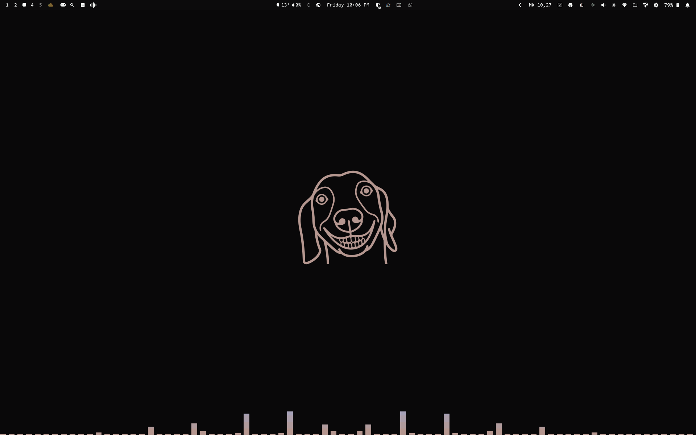

# Omarchy Cava

Cava as a desktop backdrop: a band of audio bars across the bottom of the screen,
on an empty workspace only, in the colors of whatever Omarchy theme is active.

The bars are drawn by [cava](https://github.com/karlwill/cava) itself. This
plugin is the plumbing around it: a transparent window along the bottom edge, a
window rule that keeps it out of the way, and a theme pipeline that recolors it
when you switch themes.



## What it does

- **Only on an empty workspace.** Any window opening hides the band, and closing
  the last one brings it back. Switching to another empty workspace moves it
  along, so it is on screen wherever you clear the desktop.
- **Anchored to the bottom, full width.** The terminal hosting cava is opened at a
  size in terminal cells and the window rule widens it to the monitor and pins its
  bottom edge to the bottom of the screen, so the bars sit flush against the edge
  at any font and font size.
- **Themed.** The bar colors come from the current theme's palette, resolved the
  same way the rest of Omarchy resolves colors, and the visualizer is restarted
  when the theme changes. Nothing has a hardcoded color of its own.
- **Invisible to the rest of the desktop.** No window decoration, border, shadow,
  blur or animation, and it can never take focus, so a window behind it behaves
  normally.
- **One process.** The window is moved onto a hidden special workspace rather than
  restarted, so the bars come back instantly and audio keeps flowing.

## Requirements

| | |
|---|---|
| `cava` | `omarchy pkg add cava` |
| A terminal | foot, ghostty, alacritty or kitty. Defaults to your `omarchy default terminal` |
| Audio input | whatever `cava` sees through PipeWire/PulseAudio, which is the default sink on Omarchy |

Omarchy itself, and therefore Hyprland, since the plugin installs a window rule
and watches workspace events.

## Install

```sh
omarchy plugin add https://github.com/duncio/omarchy-cava --enable
```

Enable it from the plugin menu afterwards if you skipped `--enable`. The visualizer
starts with the shell; to start it right away, restart the shell with
`omarchy restart shell`.

## Configuration

Everything is optional. The plugin reads these environment variables when it
starts the visualizer, so they can be set from your shell profile:

| Variable | Default | Meaning |
|---|---|---|
| `OMARCHY_CAVA_TERMINAL` | your default terminal | `foot`, `ghostty`, `alacritty` or `kitty` |
| `OMARCHY_CAVA_ROWS` | `16` | height of the band, in terminal rows |
| `OMARCHY_CAVA_COLUMNS` | `400` | width in terminal columns, before the window rule widens it to the screen |

The rest is plain config in the plugin directory:

| File | What it holds |
|---|---|
| `cava/config` | cava's input, output and rendering. `bar_width`, `bar_spacing`, `mode` (`bars`, `wave`, `circle`, `dots`) and the smoothing and sensitivity settings live here |
| `scripts/write-colors` | which palette entries become the gradient, in order from the bottom of the bars up |

## What it changes on your machine

Only two directories, both under `~/.local/state`:

- `omarchy/toggles/hypr/omarchy-cava.lua` — the window rule. Omarchy already loads
  every Lua file in that directory on each Hyprland config load, which is how the
  rule is installed without asking you to edit `hyprland.lua`.
- `omarchy-cava/` — the generated cava colors and a log, pointed at by
  `XDG_CONFIG_HOME` for the cava process so that your own `~/.config/cava` is left
  alone.

It edits no configuration files, installs no packages, needs no privileges, and
makes no network requests.

## Removal

```sh
~/.config/omarchy/plugins/io.github.duncio.omarchy-cava/scripts/uninstall
omarchy plugin remove io.github.duncio.omarchy-cava
```

Run the first command before the second: it stops the visualizer and deletes both
state directories, and the script itself lives in the plugin directory.

## Notes and limits

- The band is sized in terminal cells, and terminals disagree about how a cell
  becomes pixels under fractional scaling. Keep the monitor scale at 1 if the
  band looks a row or two short.
- Only foot is tested end to end. The ghostty, alacritty and kitty launch lines
  come from each terminal's documented flags for the app id, cell size,
  transparency and padding, but this machine had only foot installed to try them
  on. Set `OMARCHY_CAVA_TERMINAL` if one of them comes out wrong.
- The band follows the workspace in front of you on the monitor you are looking
  at. A second monitor does not get its own band.
- Opening the scratchpad or another special workspace does not hide the bars,
  because the workspace underneath them is still empty.
- The visualizer is not restarted when the terminal is replaced underneath it; the
  service checks every 30 seconds and starts it again if it went away.

## License

MIT, see [LICENSE](LICENSE).